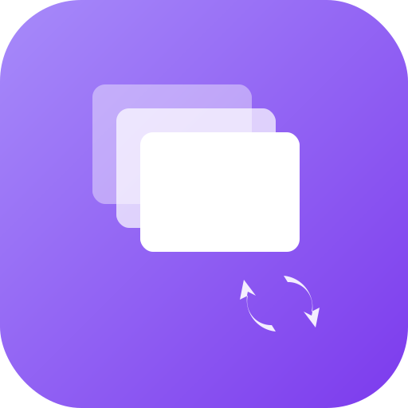

<p align="center">
  
</p>

<h1 align="center">Groo for macOS</h1>

<p align="center">
  <strong>Quick capture from your menu bar. Access anywhere.</strong>
</p>

<p align="center">
  <a href="https://github.com/groo-dev/macos/releases/latest"></a>
  <a href="https://github.com/groo-dev/macos/releases/latest"></a>
  <a href="https://github.com/groo-dev/macos/blob/main/LICENSE"></a>
</p>

<p align="center">
  <a href="#installation">Installation</a> •
  <a href="#features">Features</a> •
  <a href="#usage">Usage</a> •
  <a href="#building-from-source">Build</a>
</p>

---

## What is Groo?

Groo is a menu bar app for [Pad](https://pad.groo.dev) - a secure cross-device clipboard with end-to-end encryption. Capture text, files, and images from anywhere on your Mac and access them instantly on any device.

## Installation

### Homebrew (Recommended)

```bash
brew tap groo-dev/tap
brew install --cask groo-mac
```

### Manual Download

Download the latest `.dmg` from [Releases](https://github.com/groo-dev/macos/releases/latest), open it, and drag Groo to your Applications folder.

## Features

- **Menu Bar Access** - Always one click away from your clipboard
- **Quick Capture** - Add text, paste files, or drop images instantly
- **Keyboard First** - Navigate and copy items without touching the mouse
- **Share Extension** - Share content from any app directly to Groo
- **End-to-End Encryption** - Your data is encrypted before leaving your device
- **Cross-Device Sync** - Access your items on web, mobile, or other Macs
- **File Attachments** - Upload and sync files alongside your text snippets
- **Lightweight** - Native Swift app, minimal resource usage

## Usage

### Adding Items

| Method | How |
|--------|-----|
| **Type** | Click the menu bar icon, type in the text field, press Enter |
| **Paste** | Click the paste button or press `Cmd+V` in the text field |
| **Drag & Drop** | Drop files directly onto the menu bar icon |
| **Share** | Use the Share menu from any app |

### Keyboard Shortcuts

| Shortcut | Action |
|----------|--------|
| `Enter` | Add item / Submit |
| `Shift+Enter` | New line in text field |
| `↑` `↓` | Navigate items |
| `Enter` (on item) | Copy to clipboard |
| `Backspace` | Delete selected item |

### Pasting Files & Images

- **Paste Button**: Immediately uploads and creates an item
- **Cmd+V in Text Field**: Adds to pending list, lets you add a description before submitting

## Requirements

- macOS 14.0 (Sonoma) or later
- [Pad account](https://pad.groo.dev) with Personal Access Token

## Building from Source

```bash
# Clone the repository
git clone https://github.com/groo-dev/macos.git
cd macos

# Open in Xcode
open Groo.xcodeproj

# Build and run (Cmd+R)
```

### Requirements

- Xcode 15.0+
- macOS 14.0+ SDK

## Security

Groo uses end-to-end encryption via [Pad](https://pad.groo.dev):

- Your master password never leaves your device
- All content is encrypted client-side before sync
- We cannot read your clipboard items
- Items are decrypted only on your devices

## Debug vs Release

The app supports running Debug and Release builds side-by-side:

| Build | Bundle ID | App Name |
|-------|-----------|----------|
| Debug | `dev.groo.mac.debug` | Groo (Dev) |
| Release | `dev.groo.mac` | Groo |

Debug builds use separate keychain storage and can optionally connect to local development servers.

## Contributing

Contributions are welcome! Please feel free to submit issues and pull requests.

## License

[MIT](LICENSE)

---

<p align="center">
  Made with ❤️ by <a href="https://github.com/groo-dev">Groo</a>
</p>
